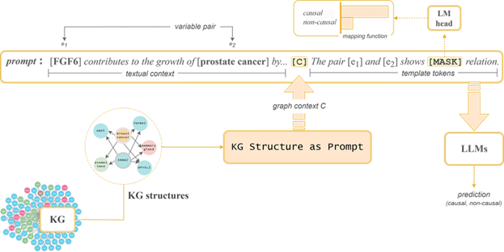

# Supplementary materials for ISWC 2024 paper: 
### KG Structure as Prompt: Improving Small Language Models Capabilities for Knowledge-based Causal Discovery

including the [datasets](datasets/), [codes](src/), and an [appendix](other-materials/Appendix.pdf) containing the hyperparameters settings and other technical details.

#### Requirements
```pip install -r requirements.txt```

#### Training
Conventional fine-tuning: `bash run_conv.sh`

(complete readme to-be-added)


